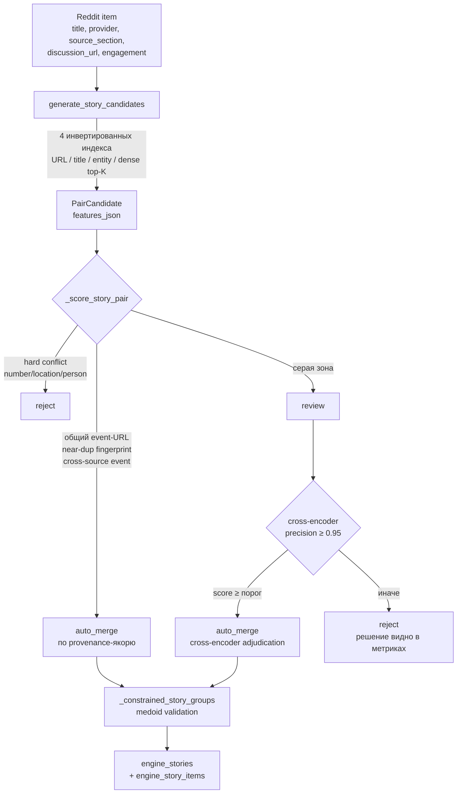
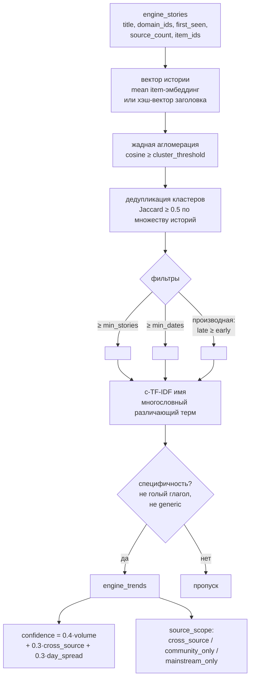
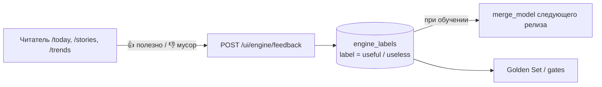

# Схемы потока данных: от Reddit до трендов

> Как сырые посты Reddit (и другие источники) превращаются в истории, тренды,
> Reddit Pulse и публикации. Схемы синхронизированы с кодом на 2026-07-30,
> включая слои Фазы 3 (обучаемый скоринг) и Фазы 5 (Trends v2).
>
> Канонический текстовый walkthrough: [`COLLECTOR_TO_TRENDS_FLOW.md`](COLLECTOR_TO_TRENDS_FLOW.md).
> Контракты и правила: [`TREND_ENGINE.md`](TREND_ENGINE.md).

## 1. Сквозной конвейер (end-to-end)

```mermaid
flowchart TD
    subgraph SRC[Источники — только публичные данные, read-only]
        R[Reddit .json API<br/>aiohttp → Playwright → RSS]
        M[Mainstream / tech СМИ<br/>RSS]
        HN[HackerNews]
        PH[ProductHunt]
    end

    subgraph COLLECT[Сбор — config-driven, пауза 4с, retry 429]
        RUN[runs / items / observations<br/>source_health]
    end

    R --> RUN
    M --> RUN
    HN --> RUN
    PH --> RUN
    RUN --> CDB[(compass.db<br/>«сырой» корпус)]

    subgraph ENGINE[Story/Trend Engine — trend_engine.db, immutable]
        DR[DataRelease<br/>frozen + checksum + input_status]
        FR[FacetRelease<br/>домены / темы / entities]
        SR[StoryRelease<br/>кандидаты → скоринг → кластеризация]
        TR[TrendRelease<br/>Trends v2: эмбеддинги + c-TF-IDF]
        SIG[SignalRelease<br/>Reddit Pulse + perspective_gap]
        PUB[RadarPublication<br/>publish / rollback указателем]
    end

    CDB -->|create_data_release<br/>mode=ro| DR
    DR --> FR --> SR --> TR
    SR --> SIG
    DR --> SIG
    TR --> PUB
    SR --> PUB

    subgraph GUI[GUI / API]
        TODAY[/today — изменения / ежедневное чтение / рубрики]
        NEWS[/news]
        STORIES[/stories]
        TRENDS[/trends]
        PULSE[/pulse — Reddit Pulse]
    end

    PUB --> TODAY
    PUB --> NEWS
    PUB --> STORIES
    PUB --> TRENDS
    SIG --> PULSE
```

**Ключевые инварианты:**
- `compass.db` для Engine — **только чтение** (`mode=ro`).
- Каждый релиз иммутабелен (SQLite-триггеры), идентифицируется `params_hash` + `git_sha`.
- Публикация — атомарный указатель `published_channels.current_publication_id`;
  rollback меняет только указатель.

## 2. Reddit → Story (как пост становится частью истории)



**Серую зону разбирает cross-encoder, а не обучаемая модель.**

`merge_model` осталась в конвейере как **диагностика**: она обучается на автометках и
пишется в `metrics_json.merge_model`, но к решению о слиянии не допускается. Убрана из
пути 6 августа по трём причинам, все измерены:

- **Обучающие данные замкнуты сами на себя.** Из 222 меток 215 — автометки,
  сгенерированные той же лестницей, которую модель должна была улучшать. Реальных
  ответов Qwen семь, при двенадцати признаках это переобучение по построению.
- **Модель переобучалась каждый цикл и не версионировалась как артефакт.** Два релиза
  различались не только данными, но и моделью, которую никто не смотрел, — это прямо
  противоречит идее сравнимых immutable-релизов.
- **Её отказ удалял пару из набора кандидатов** до того, как её увидит ранжировщик:
  16 009 пар и 944 multi-item сюжета превращались в 8 563 и 390, а выглядело это как
  деградация данных.

Условия, при которых обучаемый компонент имеет смысл вернуть, — в
[`NEXT_IMPROVEMENTS.md`](NEXT_IMPROVEMENTS.md): размеченный человеком набор,
версионирование вместе с релизом и замер против cross-encoder на отложенной выборке.

**Разметка** (`auto_label_story_pairs` → `engine_labels`) продолжает копиться: Qwen,
Claude и человеческие метки используют один canonical `item_id_a|item_id_b` key. После
валидной bounded Qwen-порции cycle materializes второй immutable StoryRelease, поэтому
review влияет на текущий выпуск.

**Приоритет источников меток** — `human > claude_review > qwen_review > assistant_review > auto_label`
(`resolve_pair_labels`). Авто-метка на паре, которую правила уже решили детерминированно,
в обучение и в оценку **не идёт**: она пересказывает правило, а не судит независимо.
Замер на 7-дневном broad: авто-разметчик покрывает 100% `auto_merge`/`reject` и лишь 3.1%
серой зоны — то есть учит тому, что уже известно, и молчит там, где решение открыто.
Метрики релиза несут `label_source`, `label_composition` и `labels_are_circular`.

**Три независимых ограничителя слияния** — узкое место может быть в любом из них:

| ограничитель | где | замер |
|---|---|---|
| пороги плотного сходства | `DENSE_THRESHOLD_PROFILES` | зависят от модели: медиана негативов 0.78 у E5 против 0.13 у `potion-base-8M` |
| порог merge-модели | `target_precision` | recall в серой зоне |
| **порог ребра до медоида** | `medoid_min_score`, дефолт 0.55 | лежал на 0.72 — выше всей серой зоны (0.45–0.65) и отсекал её целиком |

## 3. Story → Trend (Trends v2, Фаза 5)



**Что изменилось относительно графа feature-ключей:**
- Нет трендов вида «Паттерн: fall» — имена через c-TF-IDF, голые глаголы запрещены.
- Нет дублей «Боль: regulatory friction» — дедуп по пересечению историй.
- Тренд требует **динамики** (производная по дням), иначе это рубрика.
- `source_scope` — обязательное поле карточки (главный дифференциатор продукта).
- `schema_v3` — метод по умолчанию с 6 августа 2026. Действие события извлекает LLM, и
  имя тренда строится из пары (действие, домен): «product launches in AI», «new
  regulation in business». Цикл греет кэш извлечения сам, повторный прогон по тем же
  заголовкам бесплатен.
- `embedding_v2` был дефолтом до этого и остаётся доступным, но **читаемого имени дать
  не может в принципе**: он называет кластер частотными токенами. Замер на одном
  story-релизе боевого корпуса — 80 трендов и 79 нечитаемых имён («car believe old
  better choice cars truly», «kevin fed wall street warsh») против 78 трендов и нуля
  дефектных у schema_v3. Пол `trends_bad_name_count` такой релиз в broad не пускает.
- Прежний замер «109 трендов с нулём плохих имён» относился к старой проверке имён,
  которая ловила только пустые, односложные и generic-фразы. Мешок токенов она не
  видела — это и было причиной, по которой дефект дожил до прода.
- `story_graph_v1` остаётся явным выбором и фолбэком при недоступности model2vec.

## 4. Reddit Pulse и разрыв перспективы (Фаза 4)

```mermaid
flowchart TD
    RI[Reddit items релиза] --> PS[build_reddit_pulse_signals]
    PS --> SC[classify_signal_type<br/>question / pain / complaint /<br/>product_request / ai_* / …]
    PS --> MET[percentile, velocity, depth,<br/>cross-sub repetition, novelty]
    MET --> SCORE[pulse_score 0–100]

    SR2[StoryRelease] --> LINK[linkage: item → story]
    LINK --> COV[mainstream_coverage_count<br/>= число mainstream-провайдеров истории]

    BAL{perspective_gap_available?<br/>voices ≥ 100 и mainstream ≥ 20%}
    SCORE --> GAP
    COV --> GAP[compute_signal_perspective_gap]
    BAL -->|да| GAP
    BAL -->|нет — релиз несбалансирован| UNAVAIL[perspective_gap = 0.0<br/>+ флаг perspective_gap_available=false<br/>в metrics signal_release]

    GAP --> CS[community_signals]
    CS --> PULSEGUI[/pulse — Reddit Pulse<br/>топ / боль / AI / разрыв]
```

**Почему guard важен:** на релизе `ai-native` (1600 reddit / 126 mainstream) разрыв
структурно неизмерим. Вместо ложных `0.0` у всех сигналов релиз помечается
`perspective_gap_available=false`, и UI не выдаёт отсутствие данных за нулевой разрыв.
Измеримый корпус — 7-дневный `broad` (2533 reddit / 1481 mainstream).

### Выдача сигналов: тематики и ссылки

```mermaid
flowchart LR
    CS[community_signals] --> CLOUD[_pulse_topic_clouds<br/>тип + счётчик + 3 примера заголовков]
    CLOUD --> PULSE[/pulse — облака тематик]
    PULSE -->|клик по тематике| LINKS[?view=links<br/>топ-20 прямыми ссылками на посты]
    CS --> NEW[_build_today_reddit_new<br/>исключая ленту чтения]
    NEW --> QUOTA{квоты}
    QUOTA -->|≤3 на тематику| Q1[ ]
    QUOTA -->|≤2 на сабреддит| Q2[ ]
    QUOTA -->|политика ≤3 отдельно| Q3[ ]
    Q1 --> TODAY[/today — «Новое на Reddit»]
    Q2 --> TODAY
    Q3 --> TODAY
```

**Тематика сигнала — это `signal_type`, а не `domain_ids`.** Фасеты считаются по тексту
материала, а у Reddit-поста текста обычно нет: `domain_ids_json` практически всегда `other`.
Поэтому тематическая ось — тип сигнала (11 значений), а вторая ось разнообразия — сабреддит.

**Почему у политики отдельный потолок:** `policy_politics` держит самый высокий средний
pulse среди всех типов (44.9 против 31–38 у остальных). Без собственного ограничения блок
«Новое на Reddit» состоит из неё целиком.

**Почему «новое» считается по дате публикации, а не по полю `novelty`:** оно насыщено —
значение выше 0.5 у 99% сигналов, разделять им нечего.

**Почему ссылки, а не карточки:** на этом шаге пользователю нужен сам пост, а не его метрики.
Карточная сетка остаётся доступной переключателем.

## 5. Таксономия и квоты ленты (Фаза 6)

```mermaid
flowchart LR
    ITEM[item title + provider + section] --> CD[classify_domains]
    CD -->|специфичные термины;<br/>источник НЕ назначает рубрику| DOM[domain_ids<br/>≤ 3, без generic ai_technology]
    DOM --> RUB[rubric_for_domains<br/>верхний уровень — 8 рубрик]
    DOM --> RT[is_routine_beat?<br/>счёта / травмы / депт-чарты]
    RT -->|да| NEWSONLY[остаётся в /news,<br/>исключается из stories/trends]
    RT -->|нет| FEED[кандидаты → stories → trends]
    FEED --> QUOTA[apply_reddit_quota<br/>в блоке «Мир» Reddit ≤ 30%]
    QUOTA --> TODAY2[/today]
```

**Верхние рубрики (один источник истины):**
🤖 AI и технологии · 👁 Слежка и приватность · 💼 Труд и карьера ·
🏪 Бизнес и рынки · 🌍 Общество и политика · 🗺 Мир и геополитика ·
🎭 Культура и медиа · 🔬 Наука, здоровье, климат.
Второй уровень — 12 тем профиля (`config/profiles/*.json`) как фасетный фильтр.

## 6. Обратная связь замыкает цикл (Фаза 7)



Ежедневное использование само пополняет разметку без отдельного ручного труда.
